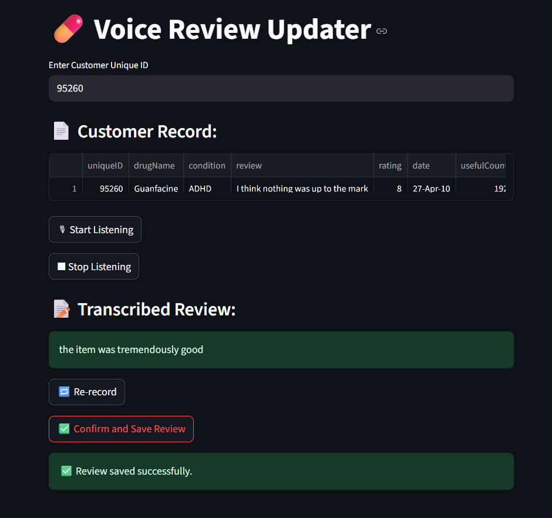

# 🎙️ Voice2CSV 
## Speak Your Reviews, No Typing Needed!

Ever wished you could just *say* something and have it magically saved in your data?  
**Voice2CSV** is a simple yet powerful app that lets you do exactly that.

---

## 🚀 What is Voice2CSV?

**Voice2CSV** is a voice-enabled Streamlit app that allows users to update customer reviews in a CSV file — using nothing but their voice. Just enter the customer's unique ID, speak your review, and the app will transcribe it and store it in the right place. No typing, no hassle.

It’s perfect for fast review entry, hands-free environments, or anyone who wants a smoother workflow.

---

## 🔍 How It Works

1. **Enter Customer ID** – Type in the unique ID of the customer whose review you want to update.
2. **Start Speaking** – Click "Start Listening" and speak your review clearly.
3. **Stop Recording** – Click "Stop" when done. The app transcribes everything you said.
4. **Save** – Review the transcription and save it to the CSV file with a single click.

Behind the scenes:
- Speech is captured using your microphone via `PyAudio`.
- Transcription is done using `Google Speech Recognition`.
- Data is managed and saved using `pandas`.

---

## 🧠 Tech Stack

| Feature            | Tech Used                   |
|--------------------|-----------------------------|
| Web UI             | [Streamlit](https://streamlit.io) |
| Speech to Text     | `speech_recognition` + Google API |
| Audio Input        | `PyAudio`                   |
| Data Storage       | CSV with `pandas`           |
| Language           | Python 3                    |

---

## 📁 Project Structure
````pgsql
voice2csv/
├── app/
│   └── streamlit_app.py       → Main Streamlit app for user interface
├── src/
│   ├── excel_utils.py         → Functions to load, update, and save CSV data
│   └── speech_to_text.py      → Handles audio recording and speech-to-text conversion
├── data/
│   └── drugs.csv              → Sample CSV file with customer IDs and reviews
├── requirements.txt           → Python dependencies
└── README.md                  
````

---

## 🛠️ Setup & Run

### 1. Clone the repository:
```bash
git clone https://github.com/yourusername/voice2csv.git
cd voice2csv
```
### 2. Install dependencies:
```bash
pip install -r requirements.txt
```
⚠️ Make sure you have PyAudio installed properly. On Windows, you might need:

```bash
pip install pipwin
pipwin install pyaudio
```
### 3. Run the app:
```bash
streamlit run app/streamlit_app.py
```

## Demo



---
## 🎯 Future Improvements
🔍 Integrate Whisper for more accurate transcription.

🌐 Add multi-language support.

📊 Export to Excel or Google Sheets.

☁️ Deploy on Streamlit Cloud or Hugging Face Spaces.

---
🙋‍♀️ Why I Built This
Typing out reviews manually in CSVs felt slow and robotic. So I thought: "Why not just speak them instead?"

This app is my little contribution to making data entry more natural, fast, and fun.

## 📬 Contact
Feel free to reach out with ideas, feedback, or collab requests!


**Made by [Insiya Fakhruddin](https://github.com/InsiyaFakhruddin)**